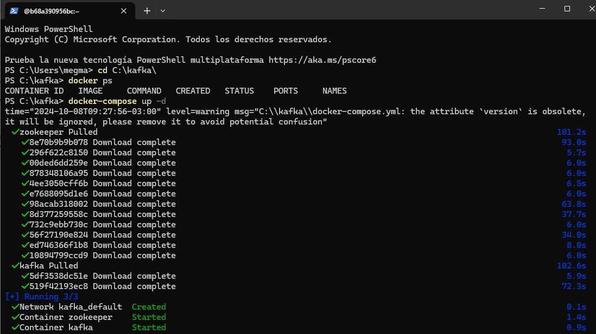
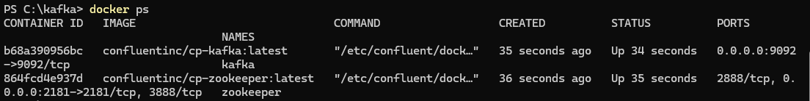
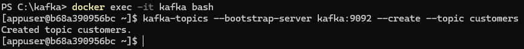
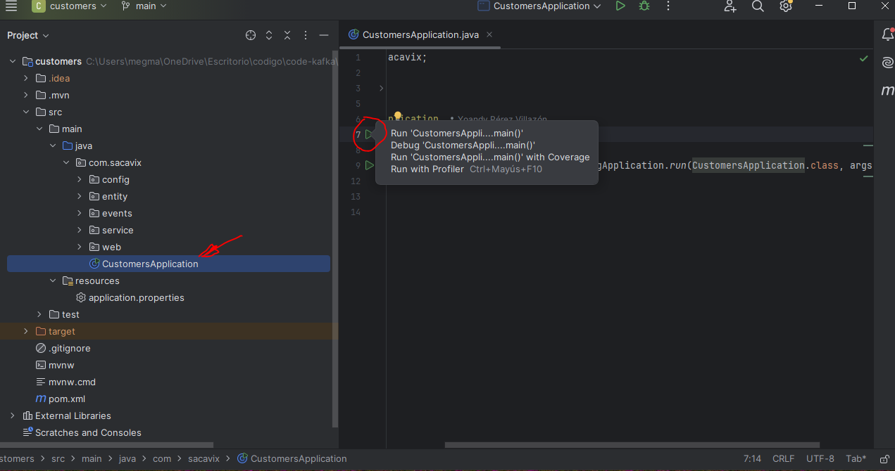
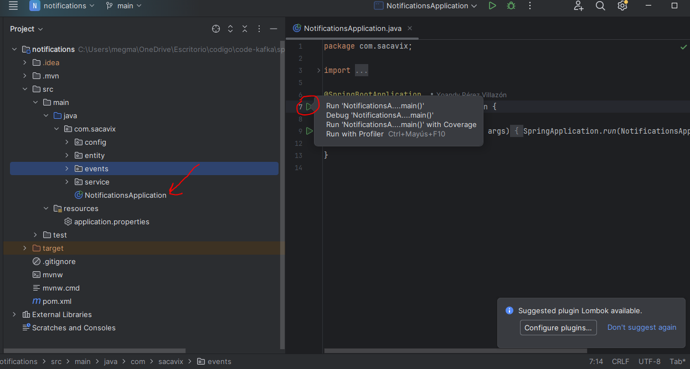

# proyecto-kafka

##Descripcion
Plataforma de transmisión de datos que permite procesar, almacenar y publicar flujos de eventos en tiempo real con docker.

##Pasos para levantar el proyecto

###1ª Kafka con Docker

Crear la carpeta donde alojar el docker file

- **ejemplo creacion ambiente Kafka**
		- C:\kafka
		- Buscar en el proyecto el archivo `docker-compose.yml` en la carpeta kafka y pegarlo en la ruta anterior
		- abrir docker-desktop para que inicialice los daemons
		- Abrir el terminal en la ruta "C:\kafka" y verificar que docker este UP con el siguiente comando `C:\kafka> docker ps`
		- Es normal que no tengo contenedores corriendo levantarlo con el siguiente comando `C:\kafka> docker-compose up -d`
		- Se instalará todo lo nesesario nuevamente verificar con el comando `C:\kafka> docker ps` y ahora si estaran los container zookeeper y kafka
		
        

- **ejemplo creacion topic kafka**
		- En la misma terminal ingresa el siguiente comando para in ingresar al bash de kafka `docker exec -it kafka bash`
		- Ya en la terminal con el siguiente comando comienza la creacion del topico es este caso "customers"
		- `[appuser@b68a390956bc ~]$ kafka-topics --bootstrap-server kafka:9092 --create --topic customers`
		
		
- **Levantar proyectos Customers y notification**
		-Abrir los proyectos por separados por ejemplo con el ide intelliJ
		-Hacer un build de ambos y levantarlos como muestra la captura
		Proy. Customer
		
		Proy. Notify
		
		
- **Prueba desde postman**
		-Desde la aplicacion postman pegarle al proyecto customers con el siguiente post:
		
- ``` 
  Customer 1:
  
		curl --location 'http://localhost:8080/customers' \
		--header 'Content-Type: application/json' \
		--data-raw '{ "id": 1,
		"name": "maria",
		"email": "maria@gmail.com"}'```

- ```
  Customer 2:
  
		curl --location 'http://localhost:8080/customers' \
		--header 'Content-Type: application/json' \
		--data-raw '{ "id": 2,
		"name": "pepe",
		"email": "pepe@gmail.com"}'```